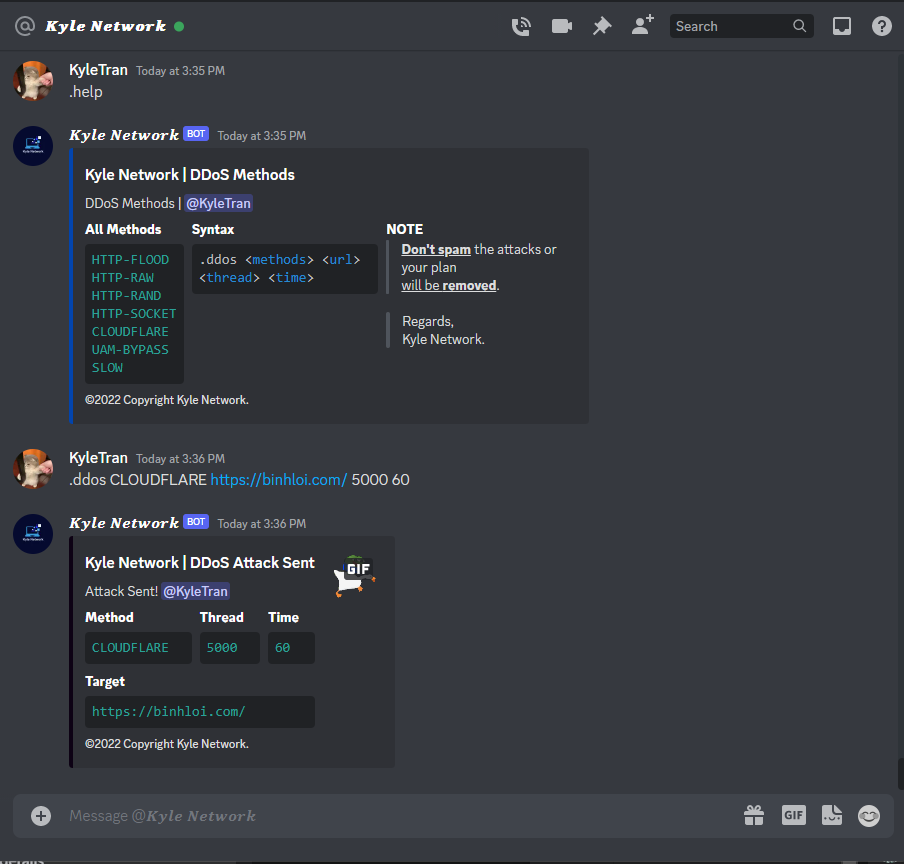
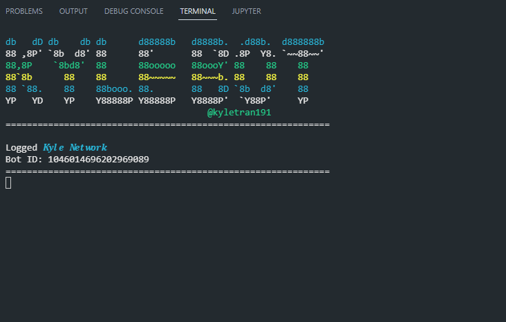

<!-- Kylebot -->
<p align="center"></p>
<p align="center">
  
  
  
  
  
</p>

<p align="center">
  
  
  </a>
</p>

<h3><p align="center">Disclaimer</p></h3>

<i>Any actions and or activities related to <b>Kylebot</b> is solely your responsibility. The misuse of this toolkit can result in <b>criminal charges</b> brought against the persons in question. <b>The author will not be held responsible</b> in the event any criminal charges be brought against any individuals misusing this toolkit to break the law.

<b>This toolkit contains materials that can be potentially damaging or dangerous for internet</b>. Refer to the laws in your province/country before accessing, using,or in any other way utilizing this in a wrong way.

<b>This Tool is made for educational purposes only</b>. Do not attempt to violate the law with anything contained here.!
</i>
### Features

- All Methods
  - HTTP-FLOOD
  - HTTP-RAW
  - HTTP-RAND
  - HTTP-SOCKET
  - CLOUDFLARE
  - UAM-BYPASS
  - SLOW
- New methods will be updated soon...
### Installation
- Installation for Windows
- Install Python, Nodejs, Golang
  ```
  https://www.python.org/downloads/
  https://nodejs.org/en/download/
  https://go.dev/dl/
  ```
- Installation for Linux
  ```
  apt-get install golang -y
  apt-get install python3 -y
  apt-get install python2 -y
  apt-get install python3-pip -y
  apt-get install nodejs -y
  apt-get install npm -y
  npm i requests
  npm i https-proxy-agent
  npm i crypto-random-string
  npm i events
  npm i fs
  npm i net
  npm i cloudscraper
  npm i request
  npm i hcaptcha-solver
  npm i randomstring
  npm i cluster
  npm i cloudflare-bypasser
  ```
- Clone this repository -
  ```
  git clone https://github.com/kyletran191/kylebot.git
  ```
- Now go to run `bot.py` -
  ```
  $ cd kylebot
  $ python bot.py
  ```
<h1>About bot</h1>
<p><li>Author: Kyle Tran</li></p>
<p><li>Version: 1.2</li></p>
<p><li>Language: Python, NodeJS, Golang</li></p>
<p><li>License: GNU General Public License v3.0</li></p>
<h1>Preview</h1>
<p align="center"></p>
<p align="center"></p>
<h1>Contact</h1>
<p><li>Email: info@xwcapital.net</li></p>
<p><li>Discord: zcrew0x/li></p>
<p><li>Telegram: @zurixw</li></p>
<h1>Thanks for using</h1>
<p><li>Please press star and fork if you find it interesting</li></p>
